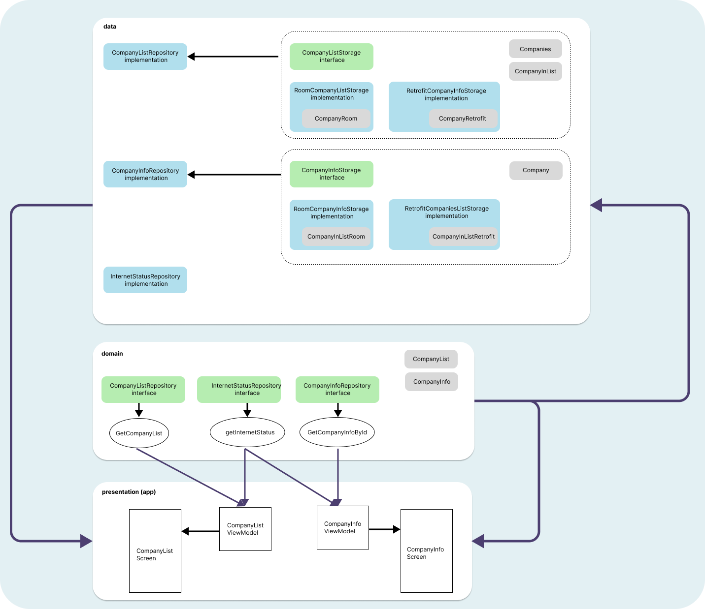
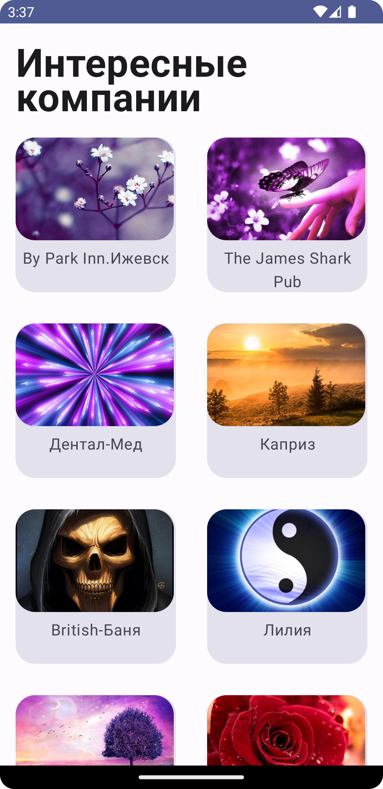
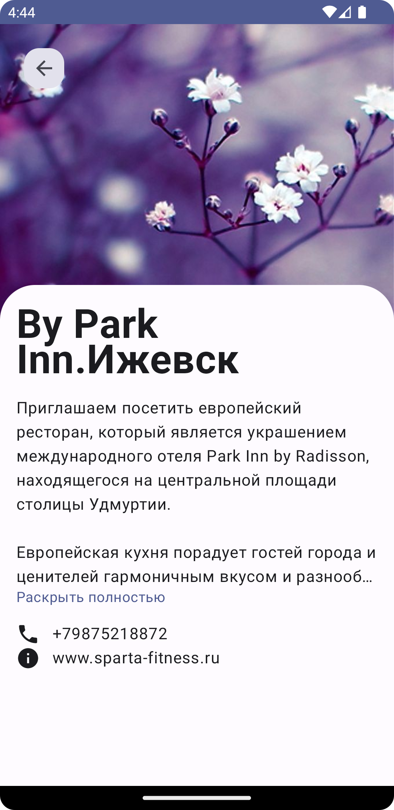
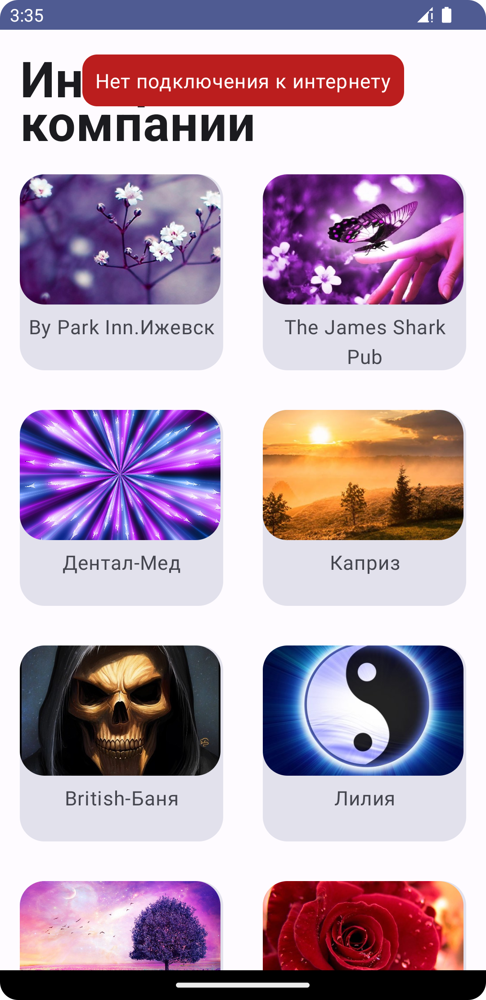
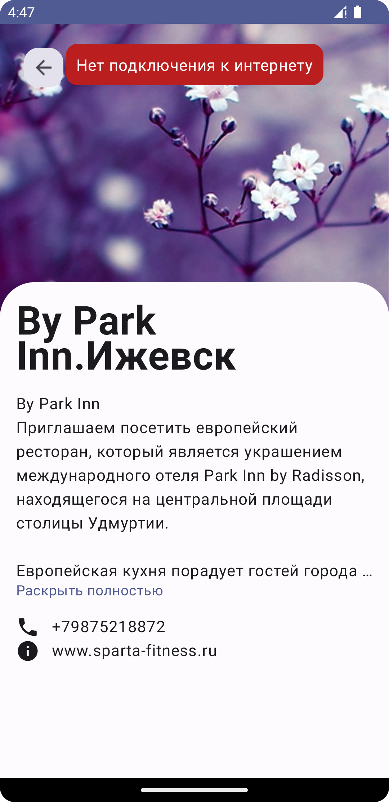

# Image To Desktop

Данное приложение работает с внешним api, по которому получает список компаний и подробную
информацию о них.

## Tech Stack

Для реализации данного приложения использовались такие технологии как:

* Kotlin:
* Jetpack Compose;
* Kotlin Coroutines;
* Retrofit 2;
* Glide (landscapist);
* Room

Архитектурное решение: **MVVM**. Архитектура приложения:   

## Фотографии из приложения

Главный экран:   
  
Экран с описанием компании:  

Главный экран без интернета:  
  
Экран с описанием компании без интернета:  

